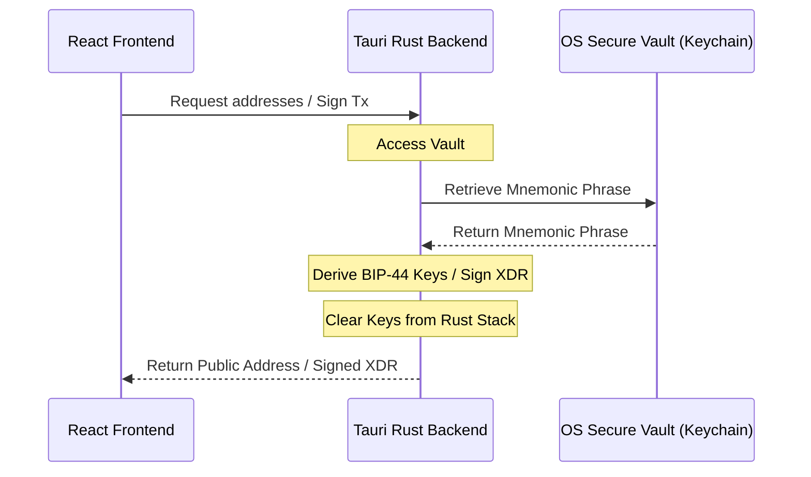

# 🛡️ Aegis Secure Vault

An open-source, desktop-native Stellar wallet manager and multisig co-signer that stores private credentials directly inside your Operating System's secure vault (Windows Credential Manager, macOS Keychain, or Linux Secret Service/KWallet) instead of sandboxed browser memory. 

---

## 🔒 Why Aegis? (Security Architecture)

Most modern cryptocurrency wallets run as browser extensions or within sandboxed Javascript environments. This design exposes users to significant risks, such as Cross-Site Scripting (XSS) attacks, malicious dependency injections, and browser-memory dumping.

**Aegis Secure Vault** solves this by implementing a strict separation of concerns:
1. **Frontend (React)**: Handles the presentation layer and collects user parameters (XDRs, destination addresses). It **never** receives, stores, or processes the mnemonic phrase or private keys in JS memory.
2. **Backend (Tauri + Rust)**: Communicates securely with the operating system's native vault.
3. **OS Secure Vault (Keyring)**: Mnemonic phrases are written directly to and read from the operating system's enterprise-grade secure store (e.g., Windows Credential Manager).
4. **Local Signing**: Stellar transaction signing happens entirely inside compiled Rust memory (`stellar-xdr` + `ed25519-dalek`) and only returns the signed XDR back to the frontend.



---

## ✨ Features

*   **OS Keyring Integration**: Complete credential isolation using native Windows, macOS, or Linux vaults.
*   **BIP-39 Mnemonic Generator**: Natively generate cryptographically secure 12-word seeds or import existing ones.
*   **BIP-44 Stellar Derivation**: Auto-derive standard Stellar public addresses (`m/44'/148'/index'`).
*   **Transaction Builder**: Natively construct and sign Stellar payment transactions locally.
*   **Multisig Co-Signer**: Paste a transaction XDR envelope, select the signing key index, and sign to append decorated signatures.
*   **Zero-Exposure Signatures**: Private key material is wiped from system memory as soon as cryptographic tasks are completed.

---

## 🚀 Getting Started

### Prerequisites

To compile and run Aegis, you will need:
*   **Node.js** (v18+)
*   **Rust and Cargo** toolchain (via `rustup`)
*   System dependencies for Tauri (refer to the [Tauri Prerequisites Guide](https://v2.tauri.app/start/prerequisites/) for your OS).

### Build & Run (Development)

1.  **Clone the Repository**:
    ```bash
    git clone https://github.com/Owolabenjade/WalletSecure.git
    cd WalletSecure
    ```

2.  **Install Frontend Dependencies**:
    ```bash
    npm install
    ```

3.  **Launch the App**:
    ```bash
    npm run tauri dev
    ```
    This launches the React development server and compiles the Rust binary.

---

## 🧪 Running Tests

Ensure your changes do not break cryptographic logic or key derivation by running the Rust unit tests:

```bash
cd src-tauri
cargo test
```

---

## 🌊 Stellar Drips Wave Program

Aegis is proud to participate in the Stellar Drips Wave program. If you are a contributor looking to claim points, check out [CONTRIBUTING.md](file:///c:/Users/PAB-NETWORK/Downloads/stellar-secure-wallet/CONTRIBUTING.md) and browse our [backlog.md](file:///c:/Users/PAB-NETWORK/Downloads/stellar-secure-wallet/backlog.md).

---

## 📄 License

This project is licensed under the MIT License. See [LICENSE](file:///c:/Users/PAB-NETWORK/Downloads/stellar-secure-wallet/LICENSE) for more details.
